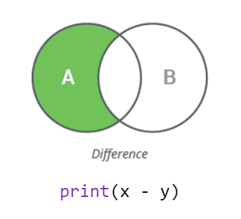

# Küme

## Oluşturma

boş küme oluştur

```python
s = set()
```

elemanı olan küme oluşturma

```python
s = set([1, 2, 3, 4])
s = {1 ,2 ,3 ,4}
```

kümelerin elemanları benzersizdir.

```python
s = {1, 1, 1, 2, 2, 3}
print(s) # {1, 2, 3}y
```

küme içerisindeki eleman "in" ile kontrol edilebilir

```python
2 in {1,2,3}
4 not in {1,2,3} # True
```

## Ekleme

add() metodu ile kümeye yeni eleman ekleyebiliriz

```python
s = {1,2,3}
s.add(4) 

print(s) # {1,2,3,4}
```

kümelerin elemanları benzersizdir

```python
s.add(1)
s.add(1)
s.add(2)

print(s) # {1,2,3,4}
```

## Silme

```python
s.discard(3) # s == {1,2,4}
s.discard(5) # s == {1,2,4}

s.remove(2) # s == {1,4}
s.remove(2) # KeyError!
```

## Metodlar


```
Method                      Operator
--------------------------------------------
a.intersection(b)               a & b
a.union(b)                      a | b
a.difference(b)                 a - b
a.symmetric_difference(b)       a ^ b
a.issubset(b)                   a <= b
a.issuperset(b)                 a >= b
```



```
method          in-place operation       in-place method
---------------------------------------------------------------------
union              s |= t                   update
intersection       s &= t                   intersection_update
difference         v -= t                   difference_update
```


### Kesişim

<figure><figcaption></figcaption></figure>

```python
s1 = {1, 2, 3, 4}
s2 = {3, 4, 5}

s3 = s1.intersection(s2) 
s3 = s1 & s2 

s1.intersection_update(s2)

# {3, 4}
```

### Birleşim

<figure><figcaption></figcaption></figure>

```python
s3 = s1.union(s2) 
s3 = s1 | s2 

s1.update(s2)

# {1, 2, 3, 4, 5}
```

### Fark

<figure><figcaption></figcaption></figure>

```
s3 = s1.difference(s2) 
s3 = s1 - s2 

s1.difference_update(s2)

# {1, 2}
```

### Simetrik Fark

<figure><figcaption></figcaption></figure>

```python
s3 = s1.symmetric_difference(s2) 
s3 = s1 ^ s2 

# {1, 2, 5}
```

### Üst Küme

<figure><figcaption></figcaption></figure>

```python
s3 = {1, 2}

s1.issuperset(s3)
s1 >= s3
# True
```

### Alt Küme

<figure><figcaption></figcaption></figure>

```python
s3.issubset(s1) 
s3 <= s1
# True
```

### Ayrık Küme

<figure><figcaption></figcaption></figure>

```python
s4 = {3, 4}
s3.isdisjoint(s4) 
# True
```

## frozenset()

```python
# frozenset farkı değiştirilemez olmasıdır. 
# diğer immutable nesneler gibi hashable'dır. 
# sözlüklerde anahtar kelime ve kümenin elemanı olabilir.

# Sets of Sets
{frozenset({1, 2}), frozenset({3, 4})}
```
